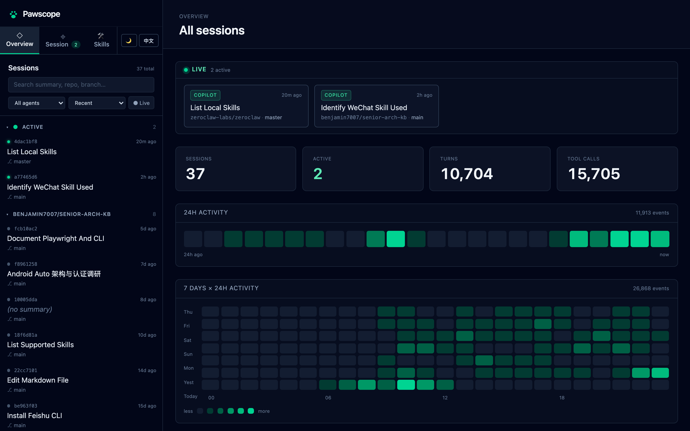

# Pawscope 🐾

[](https://github.com/benjamin7007/Pawscope/actions/workflows/ci.yml)
[](./LICENSE)
[](https://www.rust-lang.org)
[](https://github.com/benjamin7007/Pawscope)

> **A local web dashboard for inspecting the runtime state of CLI agent sessions.**
> Stop wondering what your agent is actually doing across 5 terminal windows.



```
┌─ Pawscope ──────────────────────────────────────────────────┐
│  ● 4dac1bf8   Building feature X         master             │
│  ○ 7c2afd91   Refactoring auth           feat/auth          │
│  ──────────────────────────────────────────────────────────  │
│   📁 ~/code/repo    🌿 master    🤖 claude-opus-4.7     ●   │
│   Turns: 12     ↑ 14 / ↓ 13                                 │
│   Tools used:   bash ×8   view ×11   edit ×3                │
│   Skills:       brainstorming  writing-plans                │
└──────────────────────────────────────────────────────────────┘
```

## Why

When you're juggling several `copilot`, `claude`, or `codex` sessions in
different terminals, you can't see at a glance which skills are loaded, which
tools have run, how many turns deep each conversation is, or which sessions are
still alive. Pawscope reads the on-disk state each CLI already produces
(`~/.copilot/session-state/`) and renders it on a single panel that updates in
real time.

## Quick start

```bash
cargo install --path .       # or: cargo build --release
pawscope serve             # opens http://127.0.0.1:7777 in your browser
```

Flags:

| Flag         | Default              | Notes                            |
|--------------|----------------------|----------------------------------|
| `--bind`     | `127.0.0.1:7777`     | local-only by default            |
| `--no-open`  | off                  | skip auto-launching the browser  |

## How it works

```
┌───────────────────────────────┐      ┌──────────────────────┐
│ ~/.copilot/session-state/     │      │ React 19 + Tailwind4 │
│   <uuid>/                     │      │ dashboard            │
│     workspace.yaml   ─────┐   │      │ (embedded in binary) │
│     events.jsonl     ─┐   │   │      └──────────▲───────────┘
│     inuse.<PID>.lock  │   │   │                 │ WS push
└───────────────────────┼───┼───┘                 │ + REST snapshot
                        │   │                     │
                        ▼   ▼                     │
              ┌────────────────────┐              │
              │  CopilotAdapter    │              │
              │   ─ JSONL parser   │   debounced  │
              │   ─ PID liveness   ├──── 200ms ───┤
              │   ─ notify watcher │              │
              └────────────────────┘              │
                        │                         │
                        └─────► axum server ──────┘
                               (single binary)
```

- **Adapter trait** — `AgentAdapter` in `pawscope-core` makes V2 (Claude Code,
  Codex) a pure addition: implement the trait, register the adapter.
- **No daemon** — `pawscope serve` is a regular CLI process; close the
  terminal and it's gone.
- **Local only** — binds `127.0.0.1` by default, no auth token, no telemetry.

## Roadmap

| Version | Scope                                                                |
|---------|----------------------------------------------------------------------|
| **v0.1 (MVP-1)** | Copilot CLI sessions, real-time updates, embedded UI         |
| **v0.2** | Claude Code adapter (`~/.claude/projects/`), multi-adapter fan-out, overview & activity heatmaps |
| **v0.3** | Codex CLI adapter (`~/.codex/state_*.sqlite` threads table)          |
| v0.4     | Skill marketplace + one-click install across CLIs                    |

## Architecture

Cargo workspace with three library crates plus the `pawscope` binary:

```
crates/
  pawscope-core/      # Adapter trait, shared types, errors
  pawscope-copilot/   # V1 backend: Copilot CLI session-state reader
  pawscope-server/    # axum REST + WebSocket + embedded SPA
src/main.rs             # CLI entrypoint
web/                    # React 19 + Vite + Tailwind 4 dashboard
e2e/                    # Playwright smoke tests
```

Test counts: 12 Rust unit/integration tests + 2 Playwright e2e tests.

## License

[MIT](./LICENSE) © 2026 Pawscope contributors
