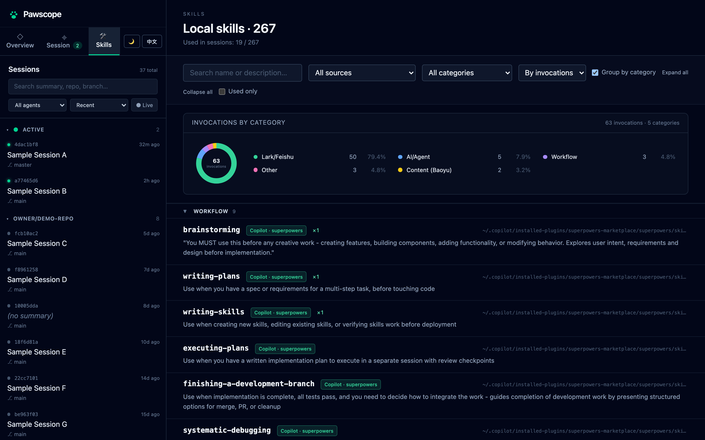
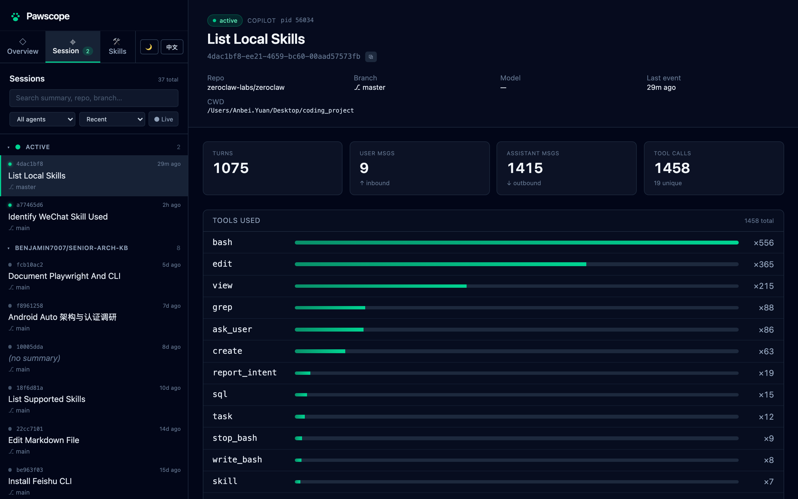
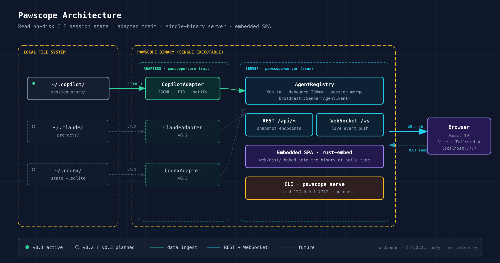

# Pawscope 🐾

[English](./README.md) · [简体中文](./README.zh-CN.md)

[](https://github.com/benjamin7007/Pawscope/actions/workflows/ci.yml)
[](https://github.com/benjamin7007/Pawscope/releases/latest)
[](./LICENSE)
[](https://www.rust-lang.org)

> A local web dashboard for inspecting the runtime state of CLI agent sessions.
> Stop wondering what your agent is actually doing across five terminal windows.


<table>
<tr>
<td width="50%"></td>
<td width="50%"></td>
</tr>
<tr>
<td align="center"><sub><b>Skills</b> — local skills grouped by category, with a usage donut</sub></td>
<td align="center"><sub><b>Session detail</b> — turns, in / out messages, ranked tool histogram</sub></td>
</tr>
</table>

---

## Why

When you're juggling several `copilot`, `claude`, or `codex` sessions in different terminals, you can't see at a glance:

- which skills are loaded
- which tools have run
- how many turns deep each conversation is
- which sessions are still alive

Pawscope reads the state each CLI already writes to disk (e.g. `~/.copilot/session-state/`) and renders it in a single panel that updates in real time. **Read-only. No daemon. Local-only by default.**

## Install

### Pre-built binaries (recommended)

Grab the latest from [Releases](https://github.com/benjamin7007/Pawscope/releases/latest):

| Platform | Asset |
|---|---|
| macOS · Apple Silicon | `pawscope-aarch64-apple-darwin.tar.gz` |
| macOS · Intel | `pawscope-x86_64-apple-darwin.tar.gz` |
| Linux · x86_64 | `pawscope-x86_64-unknown-linux-gnu.tar.gz` |
| Linux · aarch64 | `pawscope-aarch64-unknown-linux-gnu.tar.gz` |
| Windows · x86_64 | `pawscope-x86_64-pc-windows-msvc.zip` |

```bash
# macOS / Linux example
curl -fsSL -o pawscope.tar.gz \
  https://github.com/benjamin7007/Pawscope/releases/latest/download/pawscope-aarch64-apple-darwin.tar.gz
tar -xzf pawscope.tar.gz
./pawscope-aarch64-apple-darwin/pawscope serve
```

Each archive ships with a matching `.sha256` for verification.

### From source

```bash
git clone https://github.com/benjamin7007/Pawscope.git
cd Pawscope
cargo install --path .          # or: cargo build --release
```

## Quick start

```bash
pawscope serve                  # opens http://127.0.0.1:7777 in your browser
```

| Flag         | Default              | Notes                            |
|--------------|----------------------|----------------------------------|
| `--bind`     | `127.0.0.1:7777`     | local-only by default            |
| `--no-open`  | off                  | skip auto-launching the browser  |

## Architecture



- **Adapter trait** — `AgentAdapter` in `pawscope-core` makes V2 (Claude Code) and V3 (Codex) pure additions: implement the trait, register the adapter.
- **Single binary** — `pawscope-server` (axum) embeds the React 19 SPA via `rust-embed` at build time; no separate static-file step at runtime.
- **No daemon** — `pawscope serve` is a regular CLI process; close the terminal and it's gone.
- **Local only** — binds `127.0.0.1` by default, no auth token, no telemetry.

## Roadmap

| Version | Scope |
|---|---|
| v0.1 (released) | Copilot CLI sessions · real-time updates · embedded UI |
| v0.2 (released) | Claude Code adapter · multi-adapter fan-out · activity heatmap |
| v0.3 (released) | Codex CLI adapter (`~/.codex/state_*.sqlite`) |
| **v0.4** (released) | Skills coverage · prompts search · tool-call trend with drilldown · star+tag sessions · perf cache · UI polish (skeletons, toasts, progress bar, draggable sidebar, virtual scroll) |
| v0.5 | Skill marketplace + one-click install across CLIs · session comparison · keyboard shortcuts |

## Project layout

```text
crates/
  pawscope-core/      # AgentAdapter trait, shared types, errors
  pawscope-copilot/   # V1 backend: Copilot CLI session-state reader
  pawscope-claude/    # V2 backend (planned)
  pawscope-codex/     # V3 backend (planned)
  pawscope-server/    # axum REST + WebSocket + embedded SPA
src/main.rs           # CLI entrypoint
web/                  # React 19 + Vite + Tailwind 4 dashboard
e2e/                  # Playwright smoke tests
```

## License

[MIT](./LICENSE) © 2026 Pawscope contributors
